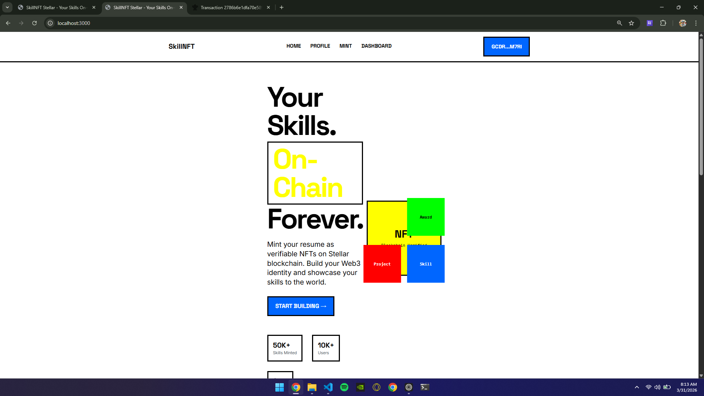
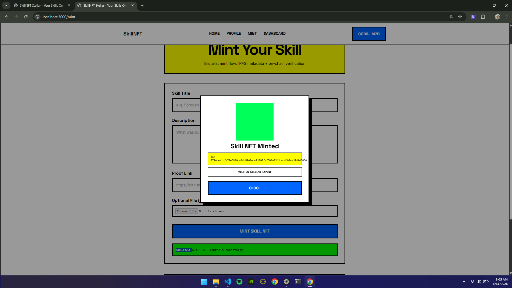
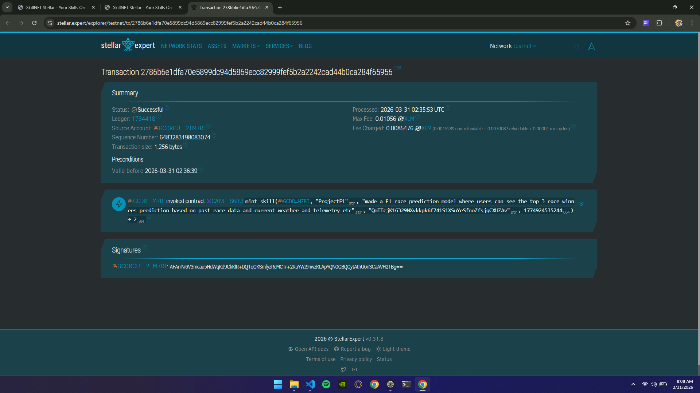
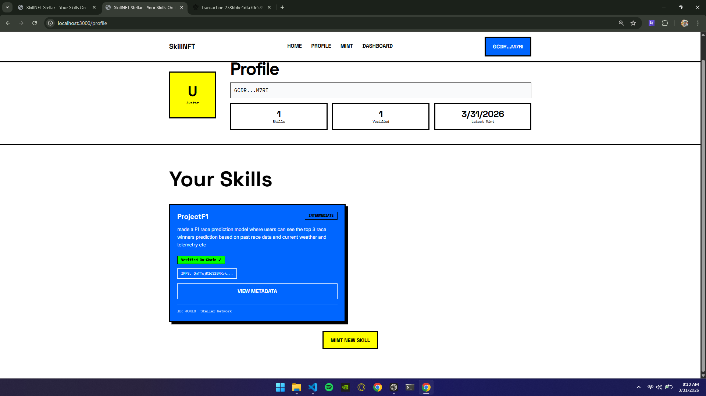

# SkillNFT Stellar - On-Chain Resume System

## Tagline
Mint your skills as verifiable on-chain credentials.

## Live Video Demo
- https://drive.google.com/file/d/1Jzg5VHMj6uX1xNPIMx3Nr41zxQhy_tHh/view?usp=drive_link

## Live Demo(Deployed on Vercel)


## Problem Statement
Hiring still depends on resumes and portfolio links that are easy to fake and hard to verify. Recruiters, DAOs, and communities spend significant time validating claims that should be cryptographically provable.

## Solution
SkillNFT Stellar turns skills into tamper-resistant on-chain credentials using Stellar Soroban. Metadata is pinned to IPFS via Pinata, and each minted skill can be independently verified by anyone.

## Features
- Freighter wallet connection for identity and transaction signing
- Skill metadata upload to IPFS (Pinata)
- On-chain minting via Soroban smart contract
- Dashboard with wallet-linked skill history
- Profile page with live contract-backed data

## Tech Stack
- Next.js 14 (App Router)
- TypeScript
- TailwindCSS
- Express.js
- Stellar Soroban SDK
- Freighter Wallet API
- Pinata IPFS

## Project Structure
```text
skillnft/
|-- frontend/                # Next.js application
|   |-- src/
|   |-- package.json
|   `-- .env.example
|-- backend/                 # Express API + Soroban/IPFS integration
|   |-- server.js
|   |-- ipfsService.js
|   |-- sorobanService.js
|   `-- .env.example
|-- image.png
|-- image-1.png
|-- image-2.png
|-- image-3.png
`-- README.md
```

## Architecture Flow
```text
User -> Frontend -> Backend -> IPFS (Pinata) -> Stellar Soroban Contract -> Dashboard/Profile
```

## Screenshots

Landing page and project branding.


Skill minting experience in the application.


Mint transaction visible on Stellar Expert.


Minted skill displayed as a verifiable credential.

## Test Output (3+ Passing)
Run tests from the repository root:

```bash
npm test
```

Expected passing summary:

```text
✓ frontend/src/lib/errorUtils.test.ts (3)
✓ frontend/src/lib/utils.test.ts (3)

Test Files  2 passed (2)
Tests       6 passed (6)
```

Screenshot placeholder (replace with your latest test screenshot before submission):


## Demo Video
- https://www.loom.com/share/your-demo-video-id

## Environment Setup

### Frontend
Create frontend/.env.local using frontend/.env.example as reference:

```env
NEXT_PUBLIC_STELLAR_NETWORK=testnet
NEXT_PUBLIC_SOROBAN_RPC_URL=https://soroban-testnet.stellar.org
NEXT_PUBLIC_CONTRACT_ADDRESS=your_contract_id
NEXT_PUBLIC_BACKEND_URL=http://localhost:4000
```

### Backend
Create backend/.env using backend/.env.example as reference:

```env
PINATA_API_KEY=your_key
PINATA_SECRET_API_KEY=your_secret
PINATA_JWT=your_optional_jwt
SOROBAN_RPC_URL=https://soroban-testnet.stellar.org
SOROBAN_NETWORK=testnet
SOROBAN_CONTRACT_ID=your_contract_id
CONTRACT_ID=your_contract_id
PORT=4000
CORS_ORIGIN=http://localhost:3000,http://localhost:3001
```

## How To Run

### 1. Start Backend
```bash
cd backend
npm install
npm start
```

### 2. Start Frontend
```bash
cd frontend
npm install
npm run dev
```

Open http://localhost:3000.

## Smart Contract Info
- Network: Stellar Testnet
- Contract ID: CAY3JDA3EPF3VN7M6DQCBC4KGUST2LBXIQOJC2XWRDFZ275GS6V6S6RU
- RPC: https://soroban-testnet.stellar.org

## Demo Flow
1. Connect Freighter wallet.
2. Fill skill title, description, and proof link.
3. Upload metadata to IPFS via backend.
4. Sign mint transaction in Freighter.
5. View minted credentials in Dashboard and Profile.

## Why This Matters
Portable, verifiable skill credentials reduce trust friction in hiring and help ecosystems evaluate contributions with higher confidence.

## Submission Notes
- Production-safe env templates are included for frontend and backend.
- Secrets are excluded from tracked files.
- Mint, dashboard, and profile flows are wired to live backend endpoints.
- Unit tests are included and executable via root `npm test`.